# SEO Architecture — ValuationExpertWitness.co.uk

**Site:** https://www.valuationexpertwitness.co.uk  
**Domain:** valuationexpertwitness.co.uk (.co.uk — natural UK geotargeting)  
**Last updated:** June 2025

This document is the single source of truth for keyword strategy, content clusters, geo-targeting, AI-citation assets, off-page targets, and deployment checklist.

---

## Implementation Status

| Asset | File | Status |
|-------|------|--------|
| Metadata helper | `lib/metadata.ts` | Live — `createMetadata()` with canonical, `x-default` hreflang, OG `en_GB`, robots |
| JSON-LD schemas | `lib/schema.ts` | Live — FAQ, breadcrumb, article, homepage, services, `DefinedTermSet` |
| Site constants | `lib/site.ts` | Live — `SITE_URL`, LinkedIn URL |
| Apex → www redirect | `middleware.ts` | Live — 301 to `www.valuationexpertwitness.co.uk` |
| Content data | `lib/data/asset-types.ts`, `case-types.ts`, `guides.ts`, `glossary.ts` | Live — 8 asset types, 10 case types, 6 guides, 34 glossary terms |
| Dynamic routes | `app/asset-types/[slug]/page.tsx`, `app/case-types/[slug]/page.tsx`, `app/guides/[slug]/page.tsx` | Live — all 24 child slugs routed |
| Hub pages | `app/valuation-types/page.tsx`, `app/asset-types/page.tsx`, `app/case-types/page.tsx`, `app/guides/page.tsx`, `app/glossary/page.tsx` | Live |
| Static pages | `app/page.tsx`, `app/what-is-a-valuation-expert-witness/page.tsx`, `app/services/page.tsx`, `app/qualifications/page.tsx`, `app/how-to-instruct/page.tsx`, `app/contact/page.tsx`, `app/privacy/page.tsx`, `app/terms/page.tsx`, `app/cookies/page.tsx` | Live |
| Removed routes | `/fees`, `/faq`, `/experts` | Intentionally removed; keywords redirected to `/how-to-instruct`, `/qualifications`, `/services` |
| Internal linking | `lib/seo/internalLinks.ts`, `HubRelatedLinks` on hub pages | Live |
| Root layout | `app/layout.tsx` | Live — `lang="en-GB"`, site metadata, verification meta from env |
| Sitemap / robots | `scripts/generate-seo.ts` → `public/sitemap.xml`, `public/robots.txt` | Live — 38 URLs; `npm run seo:verify` + `npm run seo:verify:ssr` in build |
| GEO citation tables | `app/valuation-types/page.tsx` | Live — three-discipline, multi-expert, and valuation standards tables |
| Inspired Education v Crombie content | `lib/data/case-types.ts`, `guides.ts`, `glossary.ts`, `components/AlertBanner.tsx` | Live — case-type, instruction guide, glossary term, site-wide alert banner |
| Valuation-types data module | — | Inline in page component (no `lib/data/valuation-types.ts`) |
| W&I warranty claim page | — | **Gap** — Tier 3 keyword; no case-type slug yet |

Run `npm run seo:generate` before deploy to refresh sitemap. Build pipeline runs this automatically via `npm run build`.

---

## 1. Keyword Strategy

Keywords are grouped by intent. Each keyword maps to a **primary target URL** (canonical path from `lib/data/*` or `app/` routes).

### Tier 1 — Transactional

High-intent searches from solicitors and litigators instructing valuation expert witnesses.

| Keyword | Primary target URL |
|---------|-------------------|
| valuation expert witness UK | `/` |
| valuation expert witness .co.uk | `/` |
| valuation expert witness | `/` |
| business valuation expert witness UK | `/asset-types/business-share-valuation` |
| property valuation expert witness UK | `/asset-types/property-land-valuation` |
| IP valuation expert witness UK | `/asset-types/intellectual-property-valuation` |
| plant machinery valuation expert UK | `/asset-types/plant-machinery-valuation` |
| art valuation expert witness UK | `/asset-types/art-antiques-chattels` |
| financial instruments valuation expert | `/asset-types/financial-instruments-securities` |
| specialist asset valuation expert UK | `/asset-types/specialist-assets` |

### Tier 2 — Informational

Research-phase queries from solicitors building case strategy.

| Keyword | Primary target URL |
|---------|-------------------|
| what is a valuation expert witness UK | `/what-is-a-valuation-expert-witness` |
| types of valuation in UK litigation | `/valuation-types` |
| RICS valuation expert witness UK | `/asset-types/property-land-valuation` + `/qualifications` |
| business valuation methodology litigation | `/guides/business-valuation-litigation-guide` |
| IP valuation litigation UK | `/guides/ip-valuation-litigation-guide` |
| when do you need multiple valuation experts | `/guides/multi-expert-valuation-cases` + `/valuation-types` |
| RICS Red Book expert witness UK | `/asset-types/property-land-valuation` |
| fair market value vs fair value UK | `/glossary#fair-market-value` + `/glossary#fair-value-s994` |
| Inspired Education v Crombie 2025 valuation expert | `/case-types/shareholder-disputes-business-valuation` + `/guides/valuation-expert-instruction-guide` |

### Tier 3 — Long-tail

Specific dispute and procedure queries with lower volume but high conversion potential.

| Keyword | Primary target URL |
|---------|-------------------|
| S994 shareholder dispute valuation expert UK | `/case-types/shareholder-disputes-business-valuation` |
| divorce property valuation expert witness UK | `/case-types/divorce-matrimonial-valuation` |
| compulsory purchase valuation expert witness UK | `/case-types/compulsory-purchase-valuation` |
| IP infringement reasonable royalty expert UK | `/case-types/ip-infringement-valuation` |
| plant machinery litigation valuation UK | `/asset-types/plant-machinery-valuation` |
| art antiques valuation litigation UK | `/asset-types/art-antiques-chattels` |
| HMRC IHT valuation challenge expert UK | `/case-types/tax-valuation-disputes` + `/case-types/probate-estate-disputes` |
| lease renewal rent review expert witness UK | `/case-types/lease-renewal-rent-review` |
| international arbitration valuation expert UK | `/case-types/international-arbitration-valuation` |
| W&I warranty claim valuation expert UK | **Gap** — suggest `/case-types/warranty-indemnity-valuation` (future) |

---

## 2. Content Cluster Map

Five thematic hubs with supporting pages. Hub pages receive highest internal link equity; supporting pages cross-link within cluster and link up to hub.

### Cluster diagram

```mermaid
flowchart TB
  subgraph hub1 [Hub1_ValuationTypes]
    vt["/valuation-types"]
  end
  subgraph hub2 [Hub2_AssetTypes]
    at["/asset-types"]
    atBiz["/asset-types/business-share-valuation"]
    atProp["/asset-types/property-land-valuation"]
    atIP["/asset-types/intellectual-property-valuation"]
    atPM["/asset-types/plant-machinery-valuation"]
    atArt["/asset-types/art-antiques-chattels"]
  end
  subgraph hub3 [Hub3_CaseTypes]
    ct["/case-types"]
    ctS994["/case-types/shareholder-disputes-business-valuation"]
    ctDiv["/case-types/divorce-matrimonial-valuation"]
    ctCP["/case-types/compulsory-purchase-valuation"]
    ctIP["/case-types/ip-infringement-valuation"]
    ctArb["/case-types/international-arbitration-valuation"]
  end
  subgraph hub4 [Hub4_Guides]
    g["/guides"]
    gInst["/guides/valuation-expert-instruction-guide"]
    gMulti["/guides/multi-expert-valuation-cases"]
    gBiz["/guides/business-valuation-litigation-guide"]
    gProp["/guides/property-valuation-cpr35-guide"]
    gIP["/guides/ip-valuation-litigation-guide"]
  end
  subgraph hub5 [Hub5_Glossary]
    gl["/glossary"]
  end
  vt --> at
  vt --> ct
  vt --> g
  at --> atBiz
  at --> atProp
  at --> atIP
  at --> atPM
  at --> atArt
  ct --> ctS994
  ct --> ctDiv
  ct --> ctCP
  ct --> ctIP
  ct --> ctArb
  g --> gInst
  g --> gMulti
  g --> gBiz
  g --> gProp
  g --> gIP
  ctS994 --> gInst
  vt --> gMulti
  vt --> gl
  atProp --> gProp
  atIP --> gIP
  atBiz --> gBiz
```



### Hub 1: Valuation Types (Master Pillar)

**Hub page:** `/valuation-types`

| Supporting page | Status | Notes |
|----------------|--------|-------|
| All `/asset-types` (8 slugs) | Live | Linked from valuation-types sections |
| All `/case-types` (10 slugs) | Live | Multi-expert table references dispute types |
| `/guides/multi-expert-valuation-cases` | Live | Deep-dive on multi-expert coordination |
| `/glossary` | Live | Key concepts cross-linked |
| `/what-is-a-valuation-expert-witness` | Live | Three-discipline overview |

**Tier keywords:** types of valuation in UK litigation, when do you need multiple valuation experts, fair market value vs fair value UK

### Hub 2: Asset Types

**Hub page:** `/asset-types`

| Supporting page | Status | Notes |
|----------------|--------|-------|
| `/asset-types/business-share-valuation` | Live | `lib/data/asset-types.ts` |
| `/asset-types/property-land-valuation` | Live | RICS Red Book content |
| `/asset-types/intellectual-property-valuation` | Live | Relief from royalty content |
| `/asset-types/plant-machinery-valuation` | Live | |
| `/asset-types/art-antiques-chattels` | Live | |
| `/asset-types/financial-instruments-securities` | Live | |
| `/asset-types/goodwill-intangible-assets` | Live | |
| `/asset-types/specialist-assets` | Live | |
| `/valuation-types` | Live | Master taxonomy links down |
| `/services` | Live | Service anchors per asset type |

**Tier keywords:** business valuation expert witness UK, property valuation expert witness UK, IP valuation expert witness UK, plant machinery valuation expert UK, art valuation expert witness UK, financial instruments valuation expert, specialist asset valuation expert UK

### Hub 3: Case Types

**Hub page:** `/case-types`

| Supporting page | Status | Notes |
|----------------|--------|-------|
| `/case-types/shareholder-disputes-business-valuation` | Live | Inspired Education v Crombie warning |
| `/case-types/divorce-matrimonial-valuation` | Live | Multi-expert (business + property) |
| `/case-types/compulsory-purchase-valuation` | Live | |
| `/case-types/professional-negligence-valuation` | Live | |
| `/case-types/ip-infringement-valuation` | Live | Reasonable royalty |
| `/case-types/probate-estate-disputes` | Live | HMRC IHT angle |
| `/case-types/lease-renewal-rent-review` | Live | |
| `/case-types/insurance-valuation-disputes` | Live | |
| `/case-types/tax-valuation-disputes` | Live | HMRC IHT/CGT/SDLT |
| `/case-types/international-arbitration-valuation` | Live | Hot-tubbing, FMV |

**Tier keywords:** S994 shareholder dispute, divorce property valuation, compulsory purchase, IP infringement reasonable royalty, HMRC IHT valuation challenge, lease renewal rent review, international arbitration valuation expert UK

### Hub 4: Guides

**Hub page:** `/guides`

| Supporting page | Status | Notes |
|----------------|--------|-------|
| `/guides/choosing-right-valuation-expert` | Live | Inspired Education warning |
| `/guides/business-valuation-litigation-guide` | Live | |
| `/guides/property-valuation-cpr35-guide` | Live | CPR Part 35 + RICS Red Book |
| `/guides/ip-valuation-litigation-guide` | Live | |
| `/guides/multi-expert-valuation-cases` | Live | Multi-expert scenarios |
| `/guides/valuation-expert-instruction-guide` | Live | Inspired Education v Crombie [2025] |

**Tier keywords:** business valuation methodology litigation, IP valuation litigation UK, when do you need multiple valuation experts, Inspired Education v Crombie 2025 valuation expert

### Hub 5: Glossary

**Hub page:** `/glossary`

| Supporting page | Status | Notes |
|----------------|--------|-------|
| 34 defined terms with stable anchor IDs | Live | `DefinedTermSet` schema |
| `/valuation-types` (Key Valuation Concepts) | Live | Cross-links to glossary anchors |

**Tier keywords:** fair market value vs fair value UK, RICS Red Book expert witness UK

### Canonical URL mapping

Brief paths from initial SEO planning are mapped to canonical codebase slugs. Always use the canonical path in links, sitemap, and metadata.

| Brief / shorthand path | Canonical path (codebase) |
|------------------------|---------------------------|
| `/asset-types/property` | `/asset-types/property-land-valuation` |
| `/asset-types/ip` | `/asset-types/intellectual-property-valuation` |
| `/case-types/shareholder` | `/case-types/shareholder-disputes-business-valuation` |
| `/guides/instruction-guide` | `/guides/valuation-expert-instruction-guide` |
| `/glossary#fair-value` | `/glossary#fair-value-s994` |

### Full slug inventory

**Asset types** (`lib/data/asset-types.ts`):

- `business-share-valuation`
- `property-land-valuation`
- `intellectual-property-valuation`
- `plant-machinery-valuation`
- `art-antiques-chattels`
- `financial-instruments-securities`
- `goodwill-intangible-assets`
- `specialist-assets`

**Case types** (`lib/data/case-types.ts`):

- `shareholder-disputes-business-valuation`
- `divorce-matrimonial-valuation`
- `compulsory-purchase-valuation`
- `professional-negligence-valuation`
- `ip-infringement-valuation`
- `probate-estate-disputes`
- `lease-renewal-rent-review`
- `insurance-valuation-disputes`
- `tax-valuation-disputes`
- `international-arbitration-valuation`

**Guides** (`lib/data/guides.ts`):

- `choosing-right-valuation-expert`
- `business-valuation-litigation-guide`
- `property-valuation-cpr35-guide`
- `ip-valuation-litigation-guide`
- `multi-expert-valuation-cases`
- `valuation-expert-instruction-guide`

---

## 3. .co.uk Advantage

The `valuationexpertwitness.co.uk` domain provides natural UK geotargeting without requiring a separate country subdirectory or ccTLD redirect strategy.

### Geotargeting rules

1. **Google Search Console:** Verify property as `https://www.valuationexpertwitness.co.uk`. Confirm country target = **United Kingdom** (Settings → International Targeting).
2. **No `en-US` hreflang:** Single-locale site; no US variant needed.
3. **`x-default` only:** Signal default locale for international crawlers.

### Implementation in `app/layout.tsx`

```ts
import { SITE_URL } from "@/lib/site";

export const metadata: Metadata = {
  metadataBase: new URL(SITE_URL),
  alternates: {
    canonical: SITE_URL,
    languages: { "x-default": SITE_URL },
  },
  // ...
};

// <html lang="en-GB">
```

`lib/metadata.ts` `createMetadata()` includes `alternates.languages: { "x-default": url }` on every page for consistency.

### Locale consistency

| Signal | Value | File |
|--------|-------|------|
| `<html lang>` | `en-GB` | `app/layout.tsx` |
| OpenGraph locale | `en_GB` | `lib/metadata.ts` |
| Schema `inLanguage` | `en-GB` | `lib/schema.ts` |

---

## 4. Unique Content Assets

Five differentiators with no direct competitor equivalent. Prioritise these in content builds and digital PR.

| # | Asset | Target URL | Competitor gap |
|---|-------|------------|----------------|
| 1 | Dedicated asset-type pages (8) | `/asset-types` + 8 slugs | Unique — dedicated pages per asset class |
| 2 | Master valuation taxonomy | `/valuation-types` | No competitor has this comprehensive taxonomy |
| 3 | Multi-expert scenarios table | `/valuation-types` + `/guides/multi-expert-valuation-cases` | When multiple valuation disciplines needed |
| 4 | Inspired Education v Crombie [2025] warning | `/case-types/shareholder-disputes-business-valuation` + `/guides/valuation-expert-instruction-guide` | Live case law content — high AI citation potential |
| 5 | Three-discipline comparison table | `/valuation-types` + `/what-is-a-valuation-expert-witness` | Forensic accountant vs RICS vs specialist valuer |

---

## 5. GEO Targets (AI Citation)

Structured tables and reference content designed for AI search citation (Perplexity, Google AI Overviews, ChatGPT browsing). Each asset should use semantic HTML tables and appropriate JSON-LD.

| # | Asset | Target page | Schema type |
|---|-------|-------------|-------------|
| 1 | Three-discipline master table | `/valuation-types` | `Article` + semantic `<table>` |
| 2 | Asset type valuation standards table | `/valuation-types` | `Article` + semantic `<table>` |
| 3 | Multi-expert scenarios table | `/valuation-types` | `Article` + semantic `<table>` |
| 4 | Key valuation concepts definitions | `/valuation-types` + `/glossary` | `DefinedTermSet` on `/glossary` |
| 5 | Inspired Education v Crombie warning | `/case-types/shareholder-disputes-business-valuation` + `/guides/valuation-expert-instruction-guide` | `FAQPage` / `Article` |
| 6 | RICS Red Book explained | `/asset-types/property-land-valuation` | `FAQPage` via `faqSchema()` |
| 7 | Relief from royalty explained | `/asset-types/intellectual-property-valuation` | `FAQPage` via `faqSchema()` |

### Glossary anchor IDs

Key glossary terms referenced across clusters:

`#adjusted-net-asset-value`, `#capitalisation-rate`, `#chorzow-factory-standard`, `#comparable-evidence-rics`, `#compulsory-purchase-cpo`, `#control-premium`, `#cpr-part-35`, `#depreciated-replacement-cost`, `#discounted-cash-flow-dcf`, `#expert-determination`, `#fair-market-value`, `#fair-value-s994`, `#forced-sale-value`, `#goodwill-personal-vs-business`, `#hot-tubbing`, `#iba-rules-on-evidence`, `#ikarian-reefer`, `#inspired-education-v-crombie-2025`, `#intellectual-property-valuation`, `#landlord-and-tenant-act-1954`, `#maintainable-earnings`, `#market-value-rics`, `#minority-discount`, `#net-asset-value`, `#plant-and-machinery-valuation`, `#relief-from-royalty`, `#rics-red-book`, `#rics-registered-valuer`, `#rics-expert-witness`, `#saamco-principle`, `#single-joint-expert`, `#upper-tribunal-lands-chamber`, `#willing-buyer-willing-seller`

Full glossary: **34 terms** in `lib/data/glossary.ts`.

---

## 6. Off-Page Targets

### Directories

| Directory | Action |
|-----------|--------|
| [jspubs.com](https://www.jspubs.com) | Submit firm listing — property, business valuation, IP sections |
| Academy of Experts | Submit expert witness directory entry |
| RICS expert witness directory | Submit RICS valuer listing |
| EWI (Expert Witness Institute) | Submit listing |
| CIPA | Chartered Institute of Patent Attorneys — IP valuation angle |
| Law Society finder | Submit firm/expert listing |

### Publications

Target bylined articles and expert commentary in:

- Lexology — Litigation / IP
- Practical Law — Dispute resolution
- Estates Gazette — Property valuation disputes
- Intellectual Property Magazine — IP valuation litigation
- Tax Journal — HMRC SAV / IHT valuation challenges

### Digital PR — article titles

1. **Inspired Education v Crombie [2025]: What Solicitors Must Know Before Instructing a Valuation Expert**
2. **When One Valuation Expert Is Not Enough: Multi-Discipline Cases in UK Litigation**
3. **RICS Red Book vs Fair Value: Why Valuation Instructions Fail in Court**
4. **IP Infringement Damages: Relief from Royalty in UK Litigation**

Each article should link to the relevant hub page and include a CTA to `/contact` or `/how-to-instruct`.

---

## 7. Deployment Checklist

Pre-launch and post-launch SEO tasks cross-referenced to repo files.

### Infrastructure

- [ ] **Netlify deploy** — connect repo; set production domain `valuationexpertwitness.co.uk` and `www.valuationexpertwitness.co.uk`
- [ ] **DNS** — apex and www CNAME/A records pointing to Netlify (`middleware.ts` already 301-redirects apex → www)
- [ ] **All env vars set** in Netlify production (see `.env.example`):
  - `NEXT_PUBLIC_SITE_URL=https://www.valuationexpertwitness.co.uk`
  - `NEXT_PUBLIC_FORMSPREE_FORM_ID`
  - `NEXT_PUBLIC_GA_MEASUREMENT_ID`
  - `GOOGLE_SITE_VERIFICATION`
  - `BING_SITE_VERIFICATION`

### On-page SEO

- [x] **`app/layout.tsx`** — `lang="en-GB"`, site-wide metadata, `x-default` hreflang, Google/Bing verification meta from env
- [x] **`lib/metadata.ts`** — `alternates.languages: { "x-default": url }` in `createMetadata()`
- [x] **Per-page `generateMetadata()`** — wired on hub and dynamic routes via `createMetadata()` / `metaTitle` / `metaDescription` from `lib/data/*`
- [x] **Sitemap / robots** — `scripts/generate-seo.ts` writes `public/sitemap.xml` and `public/robots.txt` (41 URLs)
- [x] **`/thank-you`** — noindex conversion page; disallowed in robots.txt

### Search Console & analytics

- [ ] **Google Search Console** — verify `www.valuationexpertwitness.co.uk`; confirm UK geotargeting
- [ ] **Bing Webmaster Tools** — verify domain
- [ ] **GA4** — `NEXT_PUBLIC_GA_MEASUREMENT_ID` wired in `components/cookies/ConsentAwareScripts.tsx`

### Content pages (build order — complete)

1. `/` — homepage with UK valuation dispute statistics table
2. `/valuation-types` — master pillar with three GEO tables
3. `/asset-types` + 8 child slugs
4. `/case-types` + 10 child slugs
5. `/guides` + 6 guide slugs
6. `/services`, `/what-is-a-valuation-expert-witness`, `/glossary`
7. `/how-to-instruct`, `/qualifications`, `/contact`
8. `/privacy`, `/terms`, `/cookies`, `/thank-you`

### Off-page

- [ ] **LinkedIn:** [ValuationExpertWitness](https://www.linkedin.com/company/valuationexpertwitness) — profile complete (URL in `lib/site.ts`)
- [ ] **Directory submissions:** jspubs, Academy of Experts, RICS, EWI
- [ ] **Digital PR:** publish 4 article titles from Section 6

---

## 8. Internal Linking Rules

Conventions for maintaining cluster authority and crawl efficiency.

### Hub → supporting

- Every hub page links to all supporting pages in its cluster.
- Hub pages include contextual link blocks to related guides, asset types, and case types.

### Supporting → hub

- Every child page (`/asset-types/[slug]`, `/case-types/[slug]`, `/guides/[slug]`) links back to its hub and to `/valuation-types`.
- Use `relatedCaseTypes`, `relatedAssetTypes`, `relatedServices` fields from `lib/data/*` for cross-cluster links.

### Cross-cluster

- Asset-type pages link to relevant case types and guides.
- Case-type pages link to relevant asset types and instruction guides.
- `/valuation-types` links to all asset-type detail pages and key guides.
- Service page links to relevant asset and case types via `/services#anchor` fragments.

### Glossary

- Glossary terms use stable anchor IDs (`/glossary#rics-red-book`, `/glossary#fair-market-value`, etc.).
- Content pages link to glossary anchors on first use of technical terms.
- Target: 34 defined terms with `DefinedTermSet` schema on `/glossary`.

### Structured data

- All child pages: `breadcrumbSchema()` from `lib/schema.ts`.
- Pages with FAQ sections: `faqSchema()`.
- Guide pages: `articleSchema()`.
- Homepage: `homepageSchema()`.
- Services page: `servicesSchema()`.
- Glossary: `definedTermSetSchema()`.

Render via `components/JsonLd.tsx`.

### Navigation

- `components/Header.tsx` — primary nav: Services, Asset Types, Case Types, Valuation Types, Guides, Contact.
- `components/Footer.tsx` — multi-column link map covering all clusters.

---

## Sitemap priority reference

From `lib/seo/publicUrlInventory.ts`:

| Route pattern | Priority | Change frequency |
|---------------|----------|------------------|
| `/` | 1.0 | weekly |
| `/valuation-types` | 0.95 | monthly |
| `/asset-types` | 0.93 | monthly |
| `/case-types`, `/services` | 0.92 | monthly |
| `/what-is-a-valuation-expert-witness` | 0.9 | monthly |
| `/asset-types/[slug]` | 0.9 | monthly |
| `/case-types/[slug]` | 0.88 | monthly |
| `/qualifications`, `/how-to-instruct` | 0.88 | monthly |
| `/guides/[slug]` | 0.8 | monthly |
| `/glossary` | 0.75 | monthly |
| `/contact` | 0.7 | monthly |
| `/privacy`, `/terms`, `/cookies` | 0.3 | yearly |

---

## Content gaps

Items to address post-launch based on GSC data and keyword coverage:

1. **W&I warranty claim** — Tier 3 keyword with no matching case-type slug; suggest `/case-types/warranty-indemnity-valuation`
2. **Valuation-types data module** — content is inline in `app/valuation-types/page.tsx`; consider extracting to `lib/data/valuation-types.ts` if content grows
3. **FAQ schema on `/valuation-types`** — implemented via `lib/data/valuation-types-faqs.ts` and `faqSchema()` on the pillar page

---

*This document should be updated when new routes are added, slug conventions change, or post-launch GSC data reveals keyword repositioning opportunities.*
